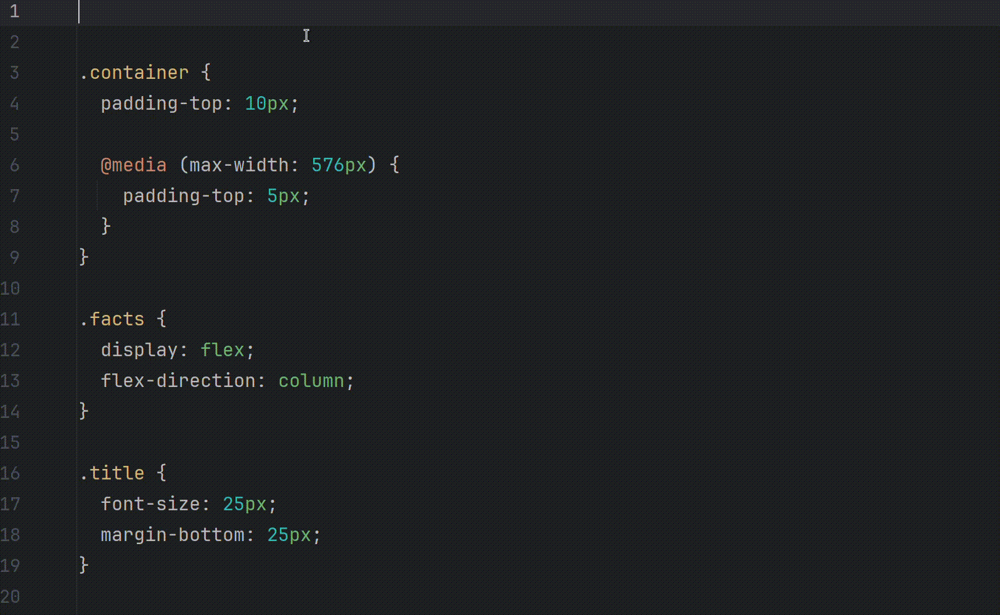

# Google Fonts for JetBrains IDEs

> Browse, search, and insert Google Fonts directly into your HTML & CSS — without leaving your IDE.



---

## Features

- **Insert font import** — opens a searchable font picker and inserts the `@import` or `<link>` snippet at the cursor (`Alt+Shift+F`)
- **Download fonts** — saves the font files directly into your project (`Alt+Shift+D`)
- **Multi-select** — pick several fonts in one go with checkboxes
- **Live search** — filter through 1,000+ Google Fonts instantly as you type
- **Smart caching** — font list is fetched once and cached for 24 hours, so the picker opens fast every time

---

## Installation

1. Open **Settings → Plugins → Marketplace**
2. Search for **Google Fonts**
3. Click **Install** and restart the IDE

Or install from disk: **Settings → Plugins → ⚙ → Install Plugin from Disk…** and select the `.zip` / `.jar` file from the [Releases](../../releases) page.

---

## Usage

| Action | Shortcut |
| --- | --- |
| Insert font import | `Alt+Shift+F` |
| Download font to project | `Alt+Shift+D` |

1. Place your cursor in an HTML or CSS file.
2. Press `Alt+Shift+F` — the font picker opens.
3. Type to filter, use checkboxes to select one or more fonts, then click **OK**.
4. The `@import` / `<link>` snippet is inserted at the cursor position.

To download font files locally, press `Alt+Shift+D` instead and choose your fonts the same way.

---

## Compatibility

| Attribute | Value |
| --- | --- |
| Plugin version | 1.4.0 |
| IDE builds | 231+ (IntelliJ IDEA 2023.1 and later) |
| Language | Kotlin / JVM 17 |

Works with any JetBrains IDE that includes the platform module: IntelliJ IDEA, WebStorm, PhpStorm, PyCharm, GoLand, Rider, etc.

---

## Building from source

```bash
git clone https://github.com/RomanAndr/google-fonts-intellij.git
cd google-fonts-intellij

# Run the plugin in a sandboxed IDE instance
./gradlew runIde

# Build a distributable zip
./gradlew buildPlugin
```

The plugin uses the [Google Fonts Developer API](https://developers.google.com/fonts/docs/developer_api). Set the `api_key` environment variable to your own key before running.

---

## License

[MIT](LICENSE)
